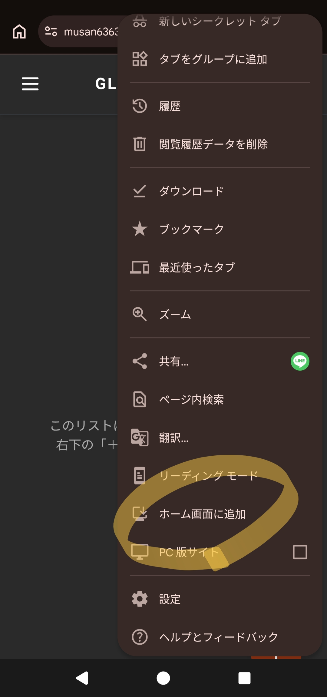

# Glue Cellar

ワインのテイスティング記録アプリです。
<https://musan6363.github.io/GlueCellar/>

## アプリの始め方

このアプリはブラウザでそのまま動作します。
スマートフォンでお使いの場合は、ブラウザのメニューから「ホーム画面に追加」を選ぶことで、通常のアプリと同じようにアイコンから起動できるようになります。

## 基本的な使い方

### ワインを記録する

1. 画面右下にある「＋」ボタンをタップします。
2. 新しい紙のカードが表示されます。
   - **Name / Country / Grapes:** ワインの名前、原産国、ブドウ品種を入力します。
   - **星評価:** 5段階でタップして評価します。もう一度タップすると星をゼロに戻せます。
   - **飲んだ回数:** ボトル（🍾）とグラス（🍷）のアイコンの横にある「＋」「ー」ボタンで、飲んだ回数を記録します。
   - **Tastes:** 「すっきり」「フルーティ」などの項目をタップすると丸が付きます。
     - 1回タップ: 点線の丸（やや感じた）
     - 2回タップ: 実線の丸（強く感じた）
     - 3回タップ: 選択解除
   - **memo:** 自由に感想を書き込めます。
3. 右下の「保存する」ボタンを押すと、記録が完了します。

### 写真やバーコードを追加する

カードの入力画面の左下にある「写真追加ボタン（山のアイコンに＋）」を押すとメニューが開きます。

- **カメラで撮る:** スマホのカメラが起動し、ワインボトルの写真を撮ってカードに貼り付けられます（最大2枚）。
- **フォルダから選ぶ:** スマホに保存されている画像を選べます。
- ~~**バーコードを記録:** ワインの裏面などにあるJANコード（数字）を手入力で記録しておけます。~~  修正中

### 記録を振り返る（ギャラリー）

ホーム画面では、保存したカードが横並びに表示されます。
画面を横にスワイプ（スクロール）することで、これまでの記録をパラパラとめくるように振り返ることができます。
カードをタップすると、再び編集画面が開き、メモの追記や評価の変更が可能です。

## リストの管理とバックアップ

ワインの記録は「リスト」ごとに分けてバックアップや共有向けに管理できます。

### リストを切り替える・名前を変える

1. 画面上部にあるリスト名（最初は「GLUE CELLAR」）をタップします。
2. メニューが開き、リストの切り替えができます。
3. リスト名の横にある鉛筆マーク（✏️）を押すと、リストの名前を自由に変更できます。
4. ゴミ箱マーク（🗑️）を押すと、そのリストと中の記録をすべて削除します。

### データのバックアップと共有

画面左上のメニューボタン（三本線）から、以下の操作が可能です。

- **今のリストを出力:**
  現在開いているリストのすべてのデータをファイルとしてスマートフォンやPCに保存（バックアップ）します。
- **リストを取り込む:**
  過去に保存したバックアップファイルや、友人から送ってもらったファイルを取り込むことができます。取り込んだデータは現在の記録に上書きされることはなく、新しい「別のリスト」として安全に追加されます。
